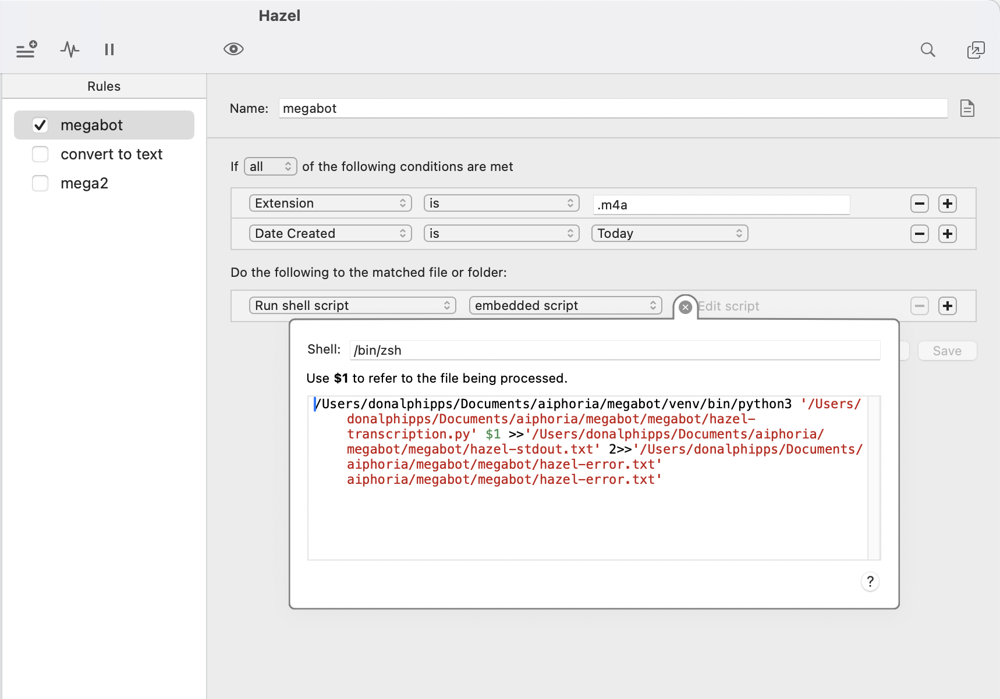
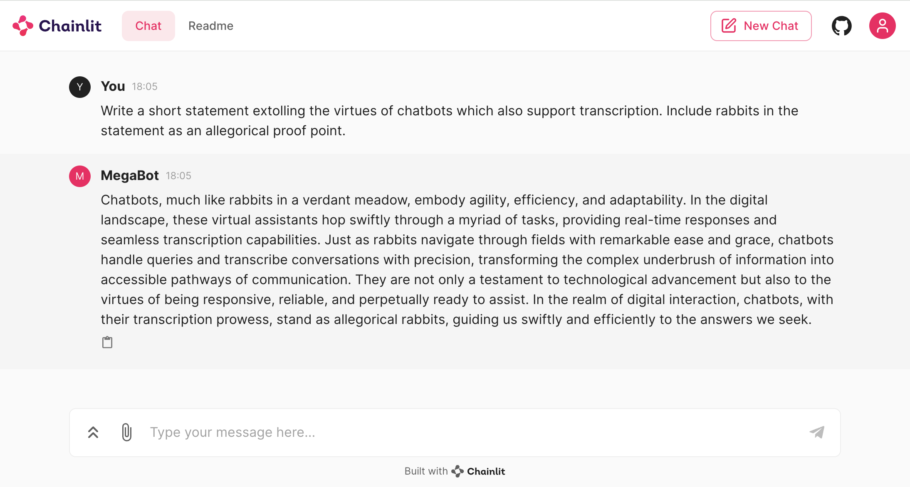

## Table of Contents

- [EphemerEar Setup](#ephemerear-setup)
  - [Prerequisites](#prerequisites)
  - [Step 1: Install Dependencies](#step-1-install-dependencies)
  - [Step 2: Configure Your Application](#step-2-configure-your-application)
    - [YAML Configuration](#yaml-configuration)
    - [Hazel Configuration](#hazel-configuration)
      - [Example Hazel Shell Script](#example-hazel-shell-script)
      - [Example Hazel Config](#example-hazel-config)
  - [Application Workflow](#application-workflow)
  - [Demonstration](#demonstration)
  - [Using a Chat UI with Chainlit](#using-a-chat-ui-with-chainlit)
    - [Example Chat Interaction](#example-chat-interaction)

## EphemerEar setup

This guide walks you through setting up EphemerEar, an application that automates voice recording transcription and triggers GPT-4 based conversations. It leverages Hazel for macOS to monitor new voice recordings and processes them according to your specifications.

Intended use is to allow you to capture any voice recording on your iPhone, iPad, Apple Watch or Mac and have your thoughts automatically transcribed and filed away for future reference. This can be useful for capturing "shower thoughts", working and thinking away from a desk and triggering automations (e.g. adding to-dos) to run based on your spoken input.

### Prerequisites

- Python 3.6 or higher
- [Hazel for macOS](https://www.noodlesoft.com/)
- Obsidian (optional, for viewing outputs)

### Step 1: Install Dependencies

### 1. Install Homebrew

Homebrew is a package manager for macOS that simplifies the installation of software. Open Terminal and run:

```shell
/bin/bash -c "$(curl -fsSL https://raw.githubusercontent.com/Homebrew/install/HEAD/install.sh)"
```

For detailed instructions, visit the [Homebrew website](https://brew.sh/).

#### 2. Install Python

`EphemerEar` is a Python-based module, so you'll need Python installed. macOS comes with Python, but it's usually a good idea to install a more recent version and manage it via Homebrew:

```shell
brew install python
```

This command installs Python 3. After installation, verify it by running `python3 --version`.

For more information, refer to the [Homebrew and Python documentation](https://docs.brew.sh/Homebrew-and-Python).

#### 3. Create a GitHub Account and Download the Repository

If you haven't already, create a GitHub account at [GitHub's website](https://github.com/). Once your account is set up, navigate to the `EphemerEar` repository page and download the repository. You can do this by clicking the `Code` button and then `Download ZIP`.

#### 4. Choose a Suitable Location for the Repository

It's good practice to keep this source code in a location you'll find easy to remember and access. Consider creating a directory named `Projects` or `Development` in your home directory.

After downloading the `EphemerEar` repository, unzip it to your preferred location.

Here's an example of how you can do this and move the downloaded files into your home directory, in a `Development` folder:

```shell
mkdir -p ~/Development
```

Unzip the downloaded repository and move it to this new directory. You can use the Finder or the following Terminal command (adjust the command based on the name of the downloaded ZIP file):

```shell
unzip `EphemerEar`-main.zip -d ~/Development
```

It's likely that the downloaded folder will include the suffix `-main` (the main branch of this repository). I recommend renaming the folder to simply `EphemerEar`.

### 5. Create and Activate a Virtual Environment

After installing Python, you can create a virtual environment using Python's built-in `venv` module. This step isolates your project's dependencies from those installed globally on your system. Navigate to the directory where you unzipped the `EphemerEar` files and open a terminal session in that directory. Run the following to activate your virtual environment:

```shell
cd ~/Development/ephemerear
python3 -m venv venv
source venv/bin/activate
```

This command creates a virtual environment named `venv` within your project directory and activates it. While activated, any Python or pip commands will use the versions in the virtual environment rather than the global ones.

### 6. Install Dependencies

With your virtual environment activated, you can now install the dependencies required for `EphemerEar`. These dependencies are listed in the `requirements.txt` file located in the project root folder. Run the following command within the `EphemerEar` directory to install all necessary packages:

```shell
pip install -r requirements.txt
```

This command reads each line in the `requirements.txt` file and installs the specified versions of packages, ensuring that you have all the necessary libraries and tools installed in your virtual environment to run `EphemerEar` successfully.

#### 7. Install Hazel (Optional but highly recommended)

`EphemerEar` uses Hazel, so you'll need to purchase and install it. Hazel will automatically trigger calls to the transcription and GPT APIs whenever new voice recordings appear in your iCloud Drive - an extremely useful part of this setup. Check Hazel's [official website](https://www.noodlesoft.com/) for more details on installation and integration. Hazel is highly recommended for automating your life far beyond the scope of `EphemerEar`!

If you decide not to use Hazel, you may choose to trigger `EphemerEar` manually or to use a [launchD](https://en.wikipedia.org/wiki/Launchd) configuration with a folder listener. If you choose this path and are new to launchD, [here's a starter prompt to GPT3.5 to get you oriented](https://chat.openai.com/share/a81a58da-e2c4-4f42-ae50-9b330f377930).

### Step 2: Configure Your Application

#### YAML Configuration

Create a `config.yaml` file in your project directory. This will be the configuration for your personal `EphemerEar`.

You can copy the `config-template.yaml` file to inherit most information.

This YAML file is crucial for configuring the behavior of your application. Below are some settings you can customize:

- **bot**:
  - `name`: Give your bot a custom name by setting the `name` value. Default is "DemoBot".
  - `stt_engine`: Specify the Speech-to-Text (STT) engine. Use "whisper" for local processing (requires MacBook with M1 or higher) or "openai" to use OpenAI's API.
  - **Directories**: For paths such as `history_file`, `system_prompt`, `cache`, and `root_dir`, ensure you specify sensible values that reflect your directory structure. The default structure uses "bots" as the base directory.
- **user**:
  - `name`: Provide your own name by specifying the `user name` value. This personalizes the application's interactions.
  - **TXT Files**: Default TXT files are provided for `user_details`. Check the location of this txt file and add any information you'd like the bot to know about you and your preferences.
- **auth_tokens**
  - `openai`: Your OpenAI API key
  - `pushover_key` and `pushover_user` - your Pushover keys, so you can be notified when a transcription starts / ends and when a GPT response is triggered and completed.

#### Hazel Configuration

First, you need to edit the [hazel-transcription.py](ephemerear/hazel-transcription.py) file. In line 5, change the value of `BOT_PATH` to be the same as the value of `bot.root_dir` from your personal config.yaml file. This is so that the hazel transcription script will instantiate a bot with your configuraiton and send the transcript output to the right location.

Set up Hazel to monitor the folder where your voice recordings are synced to on your Macbook. Configure Hazel to trigger the `hazel-transcription.py` script when new recordings are detected.

Currently, the location for Voice Memos is:

`/Users/{your_user_name}/Library/Group Containers/group.com.apple.VoiceMemos.shared/Recordings`

If you have any problems, you might need to [do some googling](https://www.google.com/search?q=which+folder+do+icloud+voice+recordings+sync+to+on+mac%3F) to confirm the correct location.

##### Example hazel shell script:

Note the stdout and stderror locations - this is recommended in case of hazel trigger problems so you can inspect these files for stdout and stderror.

```
/Users/donalphipps/Documents/aiphoria/ephemerear/venv/bin/python3 '/Users/donalphipps/Documents/aiphoria/ephemerear/ephemerear/hazel-transcription.py' $1 >>'/Users/donalphipps/Documents/aiphoria/ephemerear/ephemerear/hazel-stdout.txt' 2>>'/Users/donalphipps/Documents/aiphoria/ephemerear/ephemerear/hazel-error.txt'
```

### Example hazel config



### Application Workflow

1. **Voice Recording Processing**: Hazel detects new voice recordings (from Voice Memos app on your iPhone, iPad, Watch or Macbook). Provided that you are using iCloud to sync recordings, these should be automatically processed as soon as they sync to your Macbook. Once synced, Hazel triggers processing, generating transcripts.
2. **GPT-4 Conversations**: If "prompt" is mentioned at the beginning of the transcript, the script calls the OpenAI API with the subsequent text as input, enabling dynamic conversations.
3. **Viewing Outputs**: Transcripts and GPT-4 responses are saved to the directories specified in `config.yaml`. For an enhanced viewing experience, use Obsidian to open the `output` folder as a vault.

### Demonstration

You can look at the contents of [ephemerear-demo.ipynb](./ephemerear-demo.ipynb) to get a feel for how it generally behaves.

### Function calling (optional)

This is work-in-progress. You can define your own functions for `EphemerEar` to be able to call. This takes advantage of the [function calling](https://platform.openai.com/docs/guides/function-calling) capabilities offered by OpenAI's API.

The `EphemerEar` library tries to abstract away a little of the work with function definition. Any functions written in the `Functions.py` file and which are accompanied by valid function definition dictionaries (which must be named exactly as the function, but followed by the `_definition` suffix) will be available to your version of `EphemerEar`.

Currently the `EphemerEar` bot will be able to commit items to a To-Do list and a "Memory" list (intended for items you want to remember).
The output directory for these 2 markdown files is currently hard-coded to `bots/donbot/output/responses/todos/todos.md` and `bots/donbot/output/responses/todos/memory.md`. You can specify your own output file location in the [Functions.py](./ephemerear/Functions.py) file and this should be respected.

To test this out, ask `EphemerEar` to add an item to your ToDo list or commit an item to memory.

### Using a chat UI with chainlit

If you want to enter some text and view responses using a chat interface, you can follow the steps below:

1. Open `./app.py` and replace `donbot.yaml` in line 10 with the path to your own config yaml file
2. Start a terminal in the root directory of this repository, then enter the following (assumes you have created a virtual environment called `venv`):

```bash
source venv/bin/activate
chainlit run app.py -w
```

Your default browser should navigate to locahost:8000 and you should see a new chat window. The chatbot window will not show your full message history, but it should remember your previous conversations, up to the maximum token limit you've allocated for your conversations. Edit `bot.max_message_window` in your `config.yaml` file to alter the maximum token window for each interaction with your bot.

#### Example chat interaction


